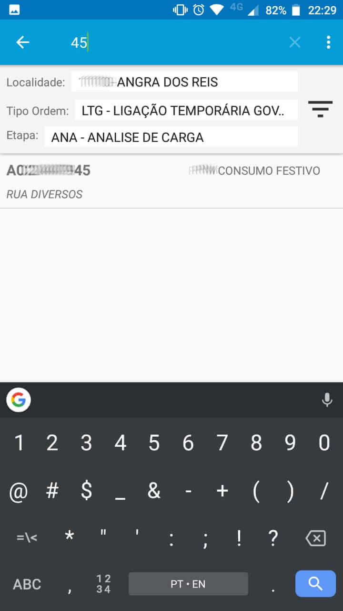

# energy-up

Protótipo de Aplicativo Android para operações de fiscalização em campo para empresas do ramo de distribuição de eletricidade.

## Objetivo

Projeto desenvolvido para facilitar, otimizar e aumentar a produtividade do Gestor de Campo / Técnico / Fiscal de forma intuitiva, amigável e prática durante a operação em campo nos casos de vistoria em ligações provisórias, cadastro de ligações clandestinas e fiscalizações diversas.

## Projeto

### Início
 

### Ligações provisórias
#### Lista
 

##### Funcionalidades da lista
  
  

#### Cadastro
 
 

##### Opções de cadastro de carga e cálculo
  
  

  

##### Levantamento de Carga
  
 

##### Álbum de fotos e compartilhamento por email
  

### Ligações Clandestinas
  

### Importar bases
 

### FAQ

